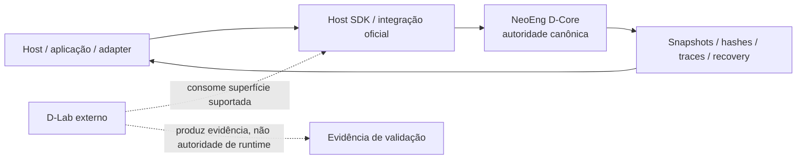
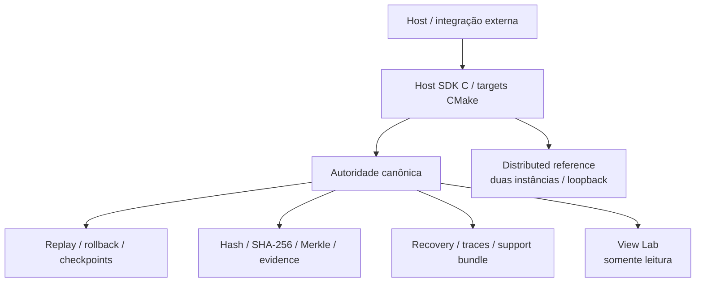

# NeoEng D-Core

**Infraestrutura determinística C++23 para autoridade canônica de estado, transições reproduzíveis, rollback, replay e evidência verificável.**

O NeoEng D-Core é um produto horizontal e independente. Ele mantém o estado canônico, aplica mudanças exclusivamente por APIs oficiais e expõe superfícies controladas para integração, observabilidade, recuperação e comparação de estado.

> **Release aceita:** `v1.14.1` no commit `e3fff973554a2e56b8bd7afdc1132f75f3ec337c`.  
> **Baseline administrativa pós-release usada nesta modernização:** `d092ac56290d76dddf51982549a98234f038f3ee` — commit que declara explicitamente nenhuma mudança de produto/runtime/ABI.  
> **Evolução pós-1.14.1:** programa `POST_1_14_1` ativo; `EV-00` é o estágio corrente no roadmap, permanece `not_started`, com `CS017` planejado; nova release não está autorizada.

## Em uma frase

O D-Core fornece uma **autoridade canônica de estado** capaz de executar transições determinísticas dentro dos contratos declarados, preservar uma linha temporal verificável e expor evidência suficiente para detectar, localizar e recuperar divergências sem transferir autoridade de mutação para consumidores externos.

## Estado de referência

| Superfície | Estado |
|---|---|
| Release histórica aceita | `v1.14.1` |
| Commit da release | `e3fff973554a2e56b8bd7afdc1132f75f3ec337c` |
| Baseline administrativa desta modernização | `d092ac56290d76dddf51982549a98234f038f3ee` |
| Host SDK | ABI C `1.0`, pacote CMake instalável |
| Programa pós-release | `POST_1_14_1` ativo |
| Estágio corrente | `EV-00`, ainda `not_started` |
| ChangeSet planejado para EV-00 | `CS017` |
| Nova release | não autorizada |
| ARM64 / hardware nativo / certificação | não inferidos da baseline atual |

O estado normativo deve ser confirmado em [`docs/governance/NEOENG_DCORE_SOURCE_OF_TRUTH.md`](docs/governance/NEOENG_DCORE_SOURCE_OF_TRUTH.md), [`audit/SOURCE_OF_TRUTH_INDEX.json`](audit/SOURCE_OF_TRUTH_INDEX.json) e nos ledgers apontados por esse índice. Este README é uma porta de entrada; não substitui essas autoridades.

## D-Core e D-Lab são projetos distintos

O **D-Core é o produto/runtime**. Um **D-Lab é infraestrutura externa de validação**. O D-Core possui contratos que definem como evidência externa pode ser usada no programa evolutivo, mas o laboratório não se torna parte do runtime e um resultado externo não amplia automaticamente claims do produto.



Em caso de conflito entre documentação de apresentação e os documentos normativos do D-Core, **os documentos normativos do D-Core prevalecem**.

## Capacidades do produto

A baseline aceita documenta, dentro de escopos específicos:

- estado canônico e transições determinísticas;
- serialização canônica, stable hash, SHA-256 e Merkle;
- checkpoints, histórico retido, rollback e ressimulação;
- replay e reconstrução dentro das fronteiras contratuais;
- localização de divergência e evidência de estado;
- recuperação, observabilidade, traces e support bundles;
- Host SDK C com handles opacos e ABI 1.0;
- referência distribuída limitada a duas instâncias e UDP loopback;
- View Lab opcional e somente leitura.

Esses itens não devem ser lidos como promessa de desempenho universal, certificação, ARM64, consenso distribuído, transporte remoto de produção ou prontidão irrestrita para missão crítica. Consulte [`docs/commercial/PUBLIC_CLAIMS.md`](docs/commercial/PUBLIC_CLAIMS.md).

## Arquitetura



A arquitetura completa e suas fronteiras estão em [`docs/ARCHITECTURE_OVERVIEW.md`](docs/ARCHITECTURE_OVERVIEW.md).

## Quick start

### Linux

Requisitos principais: CMake 3.25+, Ninja, C++23, GCC ou Clang e Boost 1.80+.

```bash
cmake --preset linux-gcc-release
cmake --build --preset linux-gcc-release --parallel
ctest --preset linux-gcc-release --output-on-failure
```

### Windows

Use um Developer PowerShell com `clang-cl`, Ninja e `VCPKG_ROOT` configurados.

```powershell
Set-ExecutionPolicy -Scope Process Bypass
.\scripts\windows\run-dcore.ps1 -BootstrapDependencies -FullTestSuite
```

Ou diretamente:

```powershell
cmake --preset windows-clang-release
cmake --build --preset windows-clang-release --parallel 2
ctest --preset windows-clang-release --output-on-failure
```

Os presets oficiais estão em [`CMakePresets.json`](CMakePresets.json).

## Consumindo o Host SDK

Após instalar o pacote em um prefixo isolado:

```cmake
find_package(NeoEngDCore CONFIG REQUIRED)

target_link_libraries(my_host
    PRIVATE
        NeoEng::DCoreHostSdk
)
```

O contrato público está em [`docs/contracts/HOST_SDK_C_ABI_V1.md`](docs/contracts/HOST_SDK_C_ABI_V1.md), e o header C em [`modules/host_sdk/include/neoeng/dcore_host.h`](modules/host_sdk/include/neoeng/dcore_host.h).

Para lifecycle, threading, buffers, rollback, recovery e exemplos de integração, veja [`docs/INTEGRATION_GUIDE.md`](docs/INTEGRATION_GUIDE.md) e [`docs/USER_GUIDE_PT-BR.md`](docs/USER_GUIDE_PT-BR.md).

## Evidência, resultados e claims

Há três perguntas diferentes:

1. **O código existe?**
2. **O comportamento foi observado/verificado em determinado corpus e ambiente?**
3. **A claim pública está autorizada com aquele escopo?**

Essas perguntas não são intercambiáveis. Um CI verde não cria claim universal; uma execução em x86_64 não qualifica ARM64; um hash igual comprova identidade do estado observado, não a correção de toda regra de negócio.

Use [`docs/RESULTS_AND_CLAIMS_GUIDE.md`](docs/RESULTS_AND_CLAIMS_GUIDE.md) antes de publicar conclusões técnicas.

## Segurança e limites de confiança

O D-Core implementa fronteiras e mecanismos de segurança, mas não deve ser apresentado como PKI, HSM, proteção DDoS de borda, consenso BFT, transporte WAN de produção ou certificação externa. Responsabilidades de host e deployment continuam explícitas.

Consulte [`docs/SECURITY_AND_TRUST_BOUNDARIES.md`](docs/SECURITY_AND_TRUST_BOUNDARIES.md) e [`docs/contracts/PRODUCTION_SECURITY_V1.md`](docs/contracts/PRODUCTION_SECURITY_V1.md).

## Documentação

Comece pelo [portal de documentação](docs/README.md).

| Objetivo | Documento |
|---|---|
| Entender o produto | [`docs/ARCHITECTURE_OVERVIEW.md`](docs/ARCHITECTURE_OVERVIEW.md) |
| Ver estado atual | [`docs/PROJECT_STATUS.md`](docs/PROJECT_STATUS.md) |
| Integrar via Host SDK | [`docs/INTEGRATION_GUIDE.md`](docs/INTEGRATION_GUIDE.md) |
| Guia operacional detalhado | [`docs/USER_GUIDE_PT-BR.md`](docs/USER_GUIDE_PT-BR.md) |
| Interpretar resultados/claims | [`docs/RESULTS_AND_CLAIMS_GUIDE.md`](docs/RESULTS_AND_CLAIMS_GUIDE.md) |
| Resolver problemas | [`docs/TROUBLESHOOTING.md`](docs/TROUBLESHOOTING.md) |
| Segurança e trust boundaries | [`docs/SECURITY_AND_TRUST_BOUNDARIES.md`](docs/SECURITY_AND_TRUST_BOUNDARIES.md) |
| Contratos normativos | [`docs/contracts/`](docs/contracts/) |
| Fonte normativa de verdade | [`docs/governance/NEOENG_DCORE_SOURCE_OF_TRUTH.md`](docs/governance/NEOENG_DCORE_SOURCE_OF_TRUTH.md) |
| Claims autorizadas | [`docs/commercial/PUBLIC_CLAIMS.md`](docs/commercial/PUBLIC_CLAIMS.md) |
| Histórico de ChangeSets | [`docs/changesets/`](docs/changesets/) |

## Estrutura do repositório

```text
include/        headers públicos do core
src/            implementação do núcleo
modules/        Host SDK, distributed reference e View Lab
apps/           probes, benchmarks e ferramentas
tests/          testes do produto
scripts/        build, verificação e campanhas
cmake/          package/export e suporte de build
docs/           arquitetura, contratos, guias e registros
audit/          ledgers e estado legível por máquina
```

## Regra de leitura

A documentação de apresentação explica **como usar e interpretar** o produto. Os documentos normativos e ledgers determinam **o que o produto pode declarar**.

Quando houver dúvida:

```text
Source of Truth / ledgers / contratos
                ↓
       estado e claims permitidos
                ↓
 README / guias / exemplos / apresentações
```

Não promova inferências de uma camada inferior para uma claim superior sem evidência e autoridade correspondentes.
