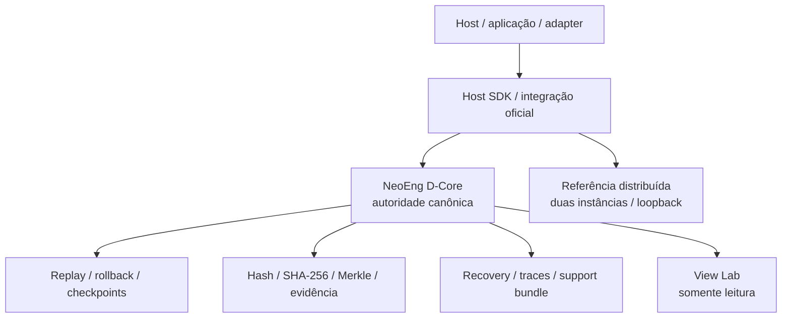

# NeoEng D-Core

**Infraestrutura determinística C++23 para autoridade canônica de estado, transições reproduzíveis, rollback, replay e evidência verificável.**

O NeoEng D-Core é um produto horizontal e independente. Ele mantém o estado canônico, aplica mudanças exclusivamente por APIs oficiais e expõe superfícies controladas para integração, observabilidade, recuperação e comparação de estado.

> **Release atual:** `v1.14.1`, publicada a partir do commit `e3fff973554a2e56b8bd7afdc1132f75f3ec337c`.
>
> **Baseline atual do repositório:** `7dbb117c107b6491e2b313333568b9155c4847ea`, correspondente à publicação do guia de uso e integração do D-Core.
> Nenhuma evolução posterior a essa baseline faz parte do estado atual deste repositório.

## Em uma frase

O D-Core fornece uma **autoridade canônica de estado** capaz de executar transições determinísticas dentro dos contratos declarados, preservar uma linha temporal verificável e expor evidência suficiente para detectar, localizar e recuperar divergências sem transferir autoridade de mutação para consumidores externos.

## Estado de referência

| Superfície | Estado |
|---|---|
| Release atual | `v1.14.1` |
| Commit da release | `e3fff973554a2e56b8bd7afdc1132f75f3ec337c` |
| Baseline atual do repositório | `7dbb117c107b6491e2b313333568b9155c4847ea` |
| Host SDK | ABI C `1.0`, pacote CMake instalável |
| Guia de uso e integração | publicado em Markdown e PDF |
| ARM64 / hardware nativo / certificação | não inferidos da baseline atual |
| Nova release | nenhuma declarada além de `v1.14.1` |

O estado normativo deve ser confirmado em [`docs/governance/NEOENG_DCORE_SOURCE_OF_TRUTH.md`](docs/governance/NEOENG_DCORE_SOURCE_OF_TRUTH.md), nos contratos e nas evidências existentes na baseline. Este README é a porta de entrada do produto; ele não amplia claims normativas.

## Arquitetura



A autoridade de estado permanece no D-Core. Hosts, interfaces, renderers, adapters, telemetria e ferramentas externas podem consumir superfícies suportadas, mas não recebem autoridade para modificar diretamente o estado canônico.

A referência distribuída é uma superfície limitada de integração entre duas instâncias independentes em UDP loopback. Ela não representa consenso, quorum, BFT, multiwriter ou transporte remoto de produção.

## Capacidades do produto

A baseline aceita documenta, dentro dos escopos declarados:

- estado canônico e transições determinísticas;
- serialização canônica, stable hash, SHA-256 e Merkle;
- checkpoints, histórico retido, rollback e ressimulação;
- replay e reconstrução dentro das fronteiras contratuais;
- localização de divergência e evidência de estado;
- recuperação, observabilidade, traces e support bundles;
- Host SDK C com handles opacos e ABI 1.0;
- referência distribuída limitada a duas instâncias e UDP loopback;
- View Lab opcional e somente leitura.

Essas capacidades não devem ser interpretadas como promessa universal de desempenho, certificação, equivalência ARM64, consenso distribuído, transporte WAN de produção ou prontidão irrestrita para sistemas de missão crítica.

As claims públicas autorizadas estão em [`docs/commercial/PUBLIC_CLAIMS.md`](docs/commercial/PUBLIC_CLAIMS.md).

## Quick start

### Linux

Requisitos principais:

- CMake 3.25 ou superior;
- Ninja;
- C++23;
- GCC ou Clang;
- Boost 1.80 ou superior.

```bash
cmake --preset linux-gcc-release
cmake --build --preset linux-gcc-release --parallel
ctest --preset linux-gcc-release --output-on-failure
```

### Windows

Use um Developer PowerShell com `clang-cl`, Ninja e `VCPKG_ROOT` configurados.

```powershell
Set-ExecutionPolicy -Scope Process Bypass
.\scripts\windows\run-dcore.ps1 -BootstrapDependencies -FullTestSuite
```

Ou diretamente:

```powershell
cmake --preset windows-clang-release
cmake --build --preset windows-clang-release --parallel 2
ctest --preset windows-clang-release --output-on-failure
```

Os presets oficiais estão em [`CMakePresets.json`](CMakePresets.json).

## Consumindo o Host SDK

Após instalar o pacote em um prefixo isolado:

```cmake
find_package(NeoEngDCore CONFIG REQUIRED)

target_link_libraries(my_host
    PRIVATE
        NeoEng::DCoreHostSdk
)
```

O contrato público da ABI está em [`docs/contracts/HOST_SDK_C_ABI_V1.md`](docs/contracts/HOST_SDK_C_ABI_V1.md), e a fronteira arquitetural está em [`docs/architecture/HOST_SDK_BOUNDARY.md`](docs/architecture/HOST_SDK_BOUNDARY.md).

O header público é [`modules/host_sdk/include/neoeng/dcore_host.h`](modules/host_sdk/include/neoeng/dcore_host.h).

Para lifecycle, integração, build, operação, rollback e recuperação, consulte o [`Guia de uso e integração`](docs/USER_GUIDE_PT-BR.md).

## View Lab

O View Lab é uma superfície opcional de inspeção somente leitura. Ele consome snapshots e traces sem adquirir autoridade sobre o estado canônico.

```powershell
.\scripts\windows\run-view-lab.ps1 -BootstrapDependencies
```

A implementação e o uso do módulo estão documentados em [`modules/view_lab/README.md`](modules/view_lab/README.md).

Artefatos visuais e diagnósticos devem ser tratados como evidência de inspeção, não como uma nova autoridade de estado.

## Evidência, resultados e claims

Três perguntas devem permanecer separadas:

1. **O código existe?**
2. **O comportamento foi observado ou verificado em determinado corpus e ambiente?**
3. **A claim pública está autorizada para aquele escopo?**

Essas perguntas não são equivalentes.

Um CI verde não cria uma claim universal. Uma execução em x86_64 não qualifica ARM64. Um hash igual comprova identidade do estado observado dentro daquele procedimento; não demonstra automaticamente correção de toda regra de negócio.

A baseline de aceitação está registrada em [`docs/changesets/015/TEST_STATUS.md`](docs/changesets/015/TEST_STATUS.md), e a campanha de assurance da release em [`docs/changesets/014/TEST_STATUS.md`](docs/changesets/014/TEST_STATUS.md).

## Segurança e limites de confiança

O D-Core implementa mecanismos e fronteiras de segurança, mas não deve ser apresentado como:

- PKI ou HSM;
- proteção DDoS de borda;
- consenso BFT;
- transporte WAN de produção;
- custódia externa de chaves;
- certificação ou auditoria independente;
- garantia universal de segurança ou disponibilidade.

As responsabilidades do núcleo e do ambiente de deployment permanecem explicitamente separadas.

Consulte:

- [`docs/architecture/PRODUCTION_SECURITY_BOUNDARY.md`](docs/architecture/PRODUCTION_SECURITY_BOUNDARY.md)
- [`docs/contracts/HARDWARE_QUALIFICATION_V2.md`](docs/contracts/HARDWARE_QUALIFICATION_V2.md)

## Release, proveniência e assurance

A release `v1.14.1` deve ser interpretada em conjunto com seu manifesto, hashes, proveniência, SBOM, contratos e evidências publicadas.

O contrato de assurance está em [`docs/contracts/RELEASE_ASSURANCE_V1.md`](docs/contracts/RELEASE_ASSURANCE_V1.md).

O repositório não contém uma chave privada de assinatura. Atestações externas devem ser verificadas usando os procedimentos e artefatos publicados para a release correspondente.

## Documentação

| Objetivo | Documento |
|---|---|
| Guia completo de uso e integração | [`docs/USER_GUIDE_PT-BR.md`](docs/USER_GUIDE_PT-BR.md) |
| Guia em PDF | [`output/pdf/NeoEng-D-Core-Guia-Usuario-v1.14.1.pdf`](output/pdf/NeoEng-D-Core-Guia-Usuario-v1.14.1.pdf) |
| Fonte normativa de verdade | [`docs/governance/NEOENG_DCORE_SOURCE_OF_TRUTH.md`](docs/governance/NEOENG_DCORE_SOURCE_OF_TRUTH.md) |
| Índice de estado documental | [`docs/governance/DOCUMENT_STATUS_INDEX.md`](docs/governance/DOCUMENT_STATUS_INDEX.md) |
| Claims públicas autorizadas | [`docs/commercial/PUBLIC_CLAIMS.md`](docs/commercial/PUBLIC_CLAIMS.md) |
| Contrato da Host SDK C ABI | [`docs/contracts/HOST_SDK_C_ABI_V1.md`](docs/contracts/HOST_SDK_C_ABI_V1.md) |
| Fronteira da Host SDK | [`docs/architecture/HOST_SDK_BOUNDARY.md`](docs/architecture/HOST_SDK_BOUNDARY.md) |
| Referência distribuída | [`docs/architecture/DISTRIBUTED_REFERENCE_BOUNDARY.md`](docs/architecture/DISTRIBUTED_REFERENCE_BOUNDARY.md) |
| Segurança de produção | [`docs/architecture/PRODUCTION_SECURITY_BOUNDARY.md`](docs/architecture/PRODUCTION_SECURITY_BOUNDARY.md) |
| View Lab | [`modules/view_lab/README.md`](modules/view_lab/README.md) |
| Assurance da release | [`docs/contracts/RELEASE_ASSURANCE_V1.md`](docs/contracts/RELEASE_ASSURANCE_V1.md) |
| Avisos e atribuições | [`NOTICE.md`](NOTICE.md) |

## Estrutura do repositório

```text
include/        headers públicos do core
src/            implementação do núcleo
modules/        Host SDK, referência distribuída e View Lab
apps/           probes, benchmarks e ferramentas
tests/          testes do produto
scripts/        build, verificação e campanhas
cmake/          package/export e suporte de build
docs/           arquitetura, contratos, guias e registros
audit/          ledgers e evidências do produto
```

## Regra de leitura

A documentação de apresentação explica **como usar e interpretar o produto**. Os documentos normativos, contratos e evidências determinam **o que o produto pode declarar**.

```text
Source of Truth / contratos / evidências
                   ↓
          estado e claims permitidos
                   ↓
       README / guias / exemplos
```

O README apresenta o produto. A autoridade técnica permanece nos contratos, documentos normativos e evidências da baseline correspondente.
