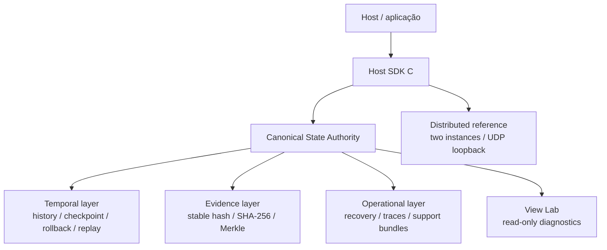
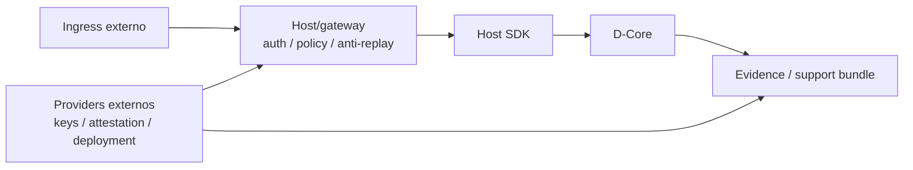

# NeoEng D-Core — Visão de arquitetura

## 1. Objetivo arquitetural

O NeoEng D-Core mantém uma autoridade canônica de estado e oferece mecanismos para produzir, comparar, reconstruir e recuperar esse estado por contratos explícitos.

A regra conceitual é:

```text
S[t+1] = f(S[t], I[t])
```

onde a transição canônica deve ser controlada pelo produto e não por consumidores que manipulam memória interna.

## 2. Topologia de alto nível



## 3. Autoridade canônica

O núcleo controla a mutação do estado. A arquitetura procura evitar:

- ponteiros externos mutáveis para o estado canônico;
- transições fora da API oficial;
- dependência da decisão canônica em relógio de parede, telemetria ou serviços externos;
- fallback silencioso quando invariantes são violados.

Consumidores recebem snapshots, cópias, summaries, hashes, traces ou outras observações controladas.

## 4. Host SDK

O Host SDK é a principal fronteira pública de integração em C.

Características importantes:

- ABI major/minor explícita;
- handles opacos;
- estruturas com `struct_size`;
- códigos de status estáveis;
- ownership e threading documentados;
- ausência de exceções C++ atravessando a ABI C;
- package CMake instalável por `NeoEngDCore`;
- target público `NeoEng::DCoreHostSdk`.

Detalhes: [`contracts/HOST_SDK_C_ABI_V1.md`](contracts/HOST_SDK_C_ABI_V1.md) e [`architecture/HOST_SDK_BOUNDARY.md`](architecture/HOST_SDK_BOUNDARY.md).

## 5. Linha temporal

A camada temporal mantém histórico dentro das políticas de retenção e suporta operações como:

- checkpoint;
- restore;
- correção histórica;
- ressimulação;
- replay;
- exportação durável autorizada.

Rollback não deve ser interpretado como capacidade de “desfazer” efeito externo irreversível já confirmado. A fronteira temporal está em [`contracts/TEMPORAL_CLOSURE_V1.md`](contracts/TEMPORAL_CLOSURE_V1.md).

## 6. Evidência de estado

O produto utiliza múltiplos identificadores com objetivos diferentes:

| Evidência | Uso |
|---|---|
| stable hash | identificação rápida/reproduzível do estado observado |
| canonical SHA-256 | digest criptográfico da serialização canônica |
| Merkle root | decomposição/localização de diferenças em estruturas suportadas |
| traces | sequência operacional/diagnóstica |
| support bundle | pacote de diagnóstico e evidência verificável |

Hash igual não prova que uma regra de negócio esteja conceitualmente correta; prova identidade sob o esquema/serialização observados.

Veja [`contracts/STATE_EVIDENCE_V1.md`](contracts/STATE_EVIDENCE_V1.md).

## 7. Recovery e observabilidade

Recovery é um protocolo explícito. Falhas externas podem produzir diretivas, ações, modos e gerações. O host deve confirmar apenas a recuperação realmente realizada e rejeitar acknowledgements obsoletos/incompatíveis.

Observabilidade é deliberadamente separada da autoridade canônica: correlation IDs, timestamps e traces podem explicar uma execução sem contaminar o resultado determinístico quando o contrato assim define.

## 8. Numeric closure

O produto utiliza contratos numéricos explícitos para rejeitar operações não representáveis em vez de depender de wraparound silencioso. Os limites exatos pertencem ao contrato [`contracts/NUMERIC_CLOSURE_V1.md`](contracts/NUMERIC_CLOSURE_V1.md).

Não trate “numeric closure” como certificação matemática universal de todas as composições do runtime.

## 9. Distributed reference

A referência distribuída demonstra um fluxo limitado entre duas instâncias independentes, incluindo comparação, divergência deliberada, correção e convergência pela API oficial.

Ela não é:

- consenso;
- BFT;
- quorum;
- ordenação multiwriter;
- exactly-once universal;
- transporte WAN de produção.

Detalhes: [`contracts/DISTRIBUTED_REFERENCE_V1.md`](contracts/DISTRIBUTED_REFERENCE_V1.md).

## 10. View Lab

O View Lab é companion opcional de diagnóstico. Ele consome snapshots/traces para inspeção, mas não recebe autoridade para mutar o estado canônico.

Sua presença não transforma o D-Core em renderer ou editor.

## 11. Segurança e trust boundaries

A segurança do produto depende de uma composição:



O D-Core não deve absorver claims pertencentes ao host, à infraestrutura de borda, ao provider criptográfico ou ao deployment. Veja [`SECURITY_AND_TRUST_BOUNDARIES.md`](SECURITY_AND_TRUST_BOUNDARIES.md).

## 12. D-Core e infraestrutura de validação

O runtime não depende de um D-Lab para funcionar. Um D-Lab executa o produto como SUT e produz evidência externa.

```text
runtime path:     host -> Host SDK -> D-Core
validation path:  D-Lab -> superfície suportada -> observações -> evidência
```

Essa separação impede que lógica necessária ao produto resida somente no laboratório e impede que um verdict externo se torne claim do produto sem a governança correspondente.

## 13. Fronteiras que devem permanecer explícitas

- produto ≠ laboratório;
- runtime ≠ verifier;
- diagnóstico ≠ autoridade canônica;
- release aceita ≠ desenvolvimento pós-release;
- simulação ≠ evidência física;
- x86_64 ≠ ARM64;
- loopback ≠ deployment remoto;
- implementação ≠ claim autorizada;
- CI verde ≠ certificação.

## 14. Próximas leituras

- [`INTEGRATION_GUIDE.md`](INTEGRATION_GUIDE.md)
- [`RESULTS_AND_CLAIMS_GUIDE.md`](RESULTS_AND_CLAIMS_GUIDE.md)
- [`SECURITY_AND_TRUST_BOUNDARIES.md`](SECURITY_AND_TRUST_BOUNDARIES.md)
- [`governance/NEOENG_DCORE_SOURCE_OF_TRUTH.md`](governance/NEOENG_DCORE_SOURCE_OF_TRUTH.md)
