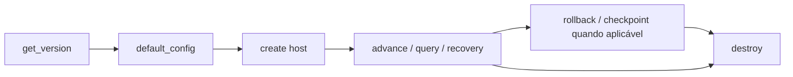

# NeoEng D-Core — Guia de integração

Este guia descreve como integrar aplicações ao NeoEng D-Core por superfícies suportadas. Ele é explicativo; o contrato da ABI prevalece.

## 1. Escolha a superfície correta

Para uma aplicação externa, prefira o **Host SDK instalado**:

```text
aplicação
   ↓
find_package(NeoEngDCore)
   ↓
NeoEng::DCoreHostSdk
   ↓
neoeng/dcore_host.h
```

Evite acoplar a integração a headers privados, `src/`, object libraries internas ou detalhes que não fazem parte do pacote instalado.

## 2. Requisitos de build

Requisitos documentados pela baseline:

- CMake 3.25+;
- C++23 para o produto;
- Ninja;
- Boost 1.80+;
- GCC/Clang em Linux;
- clang-cl em Windows;
- vcpkg conforme os presets Windows quando aplicável.

Presets oficiais: [`../CMakePresets.json`](../CMakePresets.json).

## 3. Consumidor CMake mínimo

```cmake
cmake_minimum_required(VERSION 3.25)
project(my_dcore_host LANGUAGES C)

find_package(NeoEngDCore CONFIG REQUIRED)

add_executable(my_dcore_host main.c)
target_link_libraries(my_dcore_host PRIVATE NeoEng::DCoreHostSdk)
```

A instalação deve ser suficiente para esse consumidor; depender da source tree para “fazer funcionar” enfraquece a fronteira de integração.

## 4. ABI e negociação

Antes de assumir comportamento:

1. consulte `neoeng_dcore_host_get_version()`;
2. valide ABI major/minor conforme o contrato;
3. inicialize estruturas públicas com `struct_size`;
4. obtenha uma configuração default quando apropriado;
5. trate `ABI_MISMATCH` como falha de compatibilidade, não como warning.

A ABI atual documentada é `1.0`.

## 5. Lifecycle

O fluxo típico é:



O handle deve ser destruído mesmo em caminhos de erro controlados.

## 6. Thread ownership

O handle pertence à thread que o criou. Não compartilhe o mesmo handle entre threads esperando sincronização implícita.

Arquiteturas multithread devem preferir:

- uma thread proprietária por handle;
- filas externas para serializar comandos;
- múltiplos handles independentes quando o domínio permitir;
- correlação explícita de requests sem transferir ownership.

`WRONG_THREAD` deve ser tratado como violação de contrato.

## 7. Inputs e estado

Inputs devem ser validados antes da chamada. Não dependa de:

- IDs nulos/duplicados;
- contagens acima dos limites;
- ordenação implícita não contratada;
- wraparound numérico;
- mutação externa do estado interno.

Quando uma operação for rejeitada, preserve o status e verifique se o estado anterior continua válido antes de seguir.

## 8. Buffers de saída

Para APIs de cópia, use o padrão de capacidade/required count quando documentado:

```c
uint64_t required = 0;
neoeng_dcore_status s =
    neoeng_dcore_host_copy_traces(host, NULL, 0U, &required);

/* aloque required elementos e repita */
```

Não assuma que um buffer pequeno será truncado silenciosamente. `BUFFER_TOO_SMALL` é uma resposta de contrato.

## 9. Determinismo

Para comparar duas execuções:

- fixe estado inicial;
- fixe sequência e ordenação de inputs;
- fixe configuração relevante;
- registre commit/binário/toolchain;
- compare frame, stable hash, canonical SHA-256 e Merkle root;
- mantenha correlation IDs e timestamps fora do raciocínio canônico quando o contrato os define como diagnósticos.

Uma divergência deve ser investigada, não “normalizada” removendo o teste.

## 10. Rollback e ressimulação

Use rollback/correção somente dentro da janela retida.

Registre:

- frame corrigido;
- distância do rollback;
- quantidade de frames ressimulados;
- hashes antes/depois;
- inputs corrigidos;
- efeitos externos associados.

O D-Core pode reconstruir estado; não pode garantir desfazer um efeito externo irreversível já confirmado pelo host.

## 11. Checkpoints

Checkpoints são úteis para restauração controlada, recuperação, redução de custo de replay e investigação de divergência.

`NOT_FOUND` deve permanecer erro quando o checkpoint expirou ou não existe. Não aumente retenção apenas para esconder um requisito não atendido.

## 12. Recovery

O fluxo geral é:

```text
fault report
    ↓
recovery event
    ↓
host executa ação indicada
    ↓
acknowledgement com generation correta
    ↓
accepted / rejected
```

Não reutilize generations antigas. Um status de chamada `OK` não significa necessariamente que um acknowledgement foi semanticamente aceito; leia os campos de resultado.

## 13. Network ingress

O Host SDK não deve ser tratado como parser de tráfego hostil diretamente exposto à Internet.

Uma topologia típica é:

```text
rede externa
   ↓
framing / auth / anti-replay / rate limit
   ↓
validação de comando e policy do host
   ↓
fila determinística
   ↓
Host SDK
```

Consulte [`SECURITY_AND_TRUST_BOUNDARIES.md`](SECURITY_AND_TRUST_BOUNDARIES.md).

## 14. Distributed reference

Use `NeoEng::DCoreDistributedReference` somente quando o escopo de referência de duas instâncias for realmente desejado. Não transforme esse target em solução genérica de consenso ou transporte de produção.

## 15. View Lab

O View Lab é ferramenta de inspeção. Integre-o como consumidor read-only, não como caminho de mutação de estado.

## 16. Evidência de uma integração

Uma execução profissional deve registrar:

```text
D-Core release/tag:
D-Core commit:
artifact/package hash:
host commit:
OS / arquitetura:
compilador:
CMake / Ninja:
Boost:
configuração:
comando:
exit code:
stdout/stderr:
stable hash / SHA / Merkle quando aplicável:
limitações:
```

Se o resultado for usado para claim, consulte [`RESULTS_AND_CLAIMS_GUIDE.md`](RESULTS_AND_CLAIMS_GUIDE.md).

## 17. Erros comuns

| Sintoma | Interpretação inicial |
|---|---|
| package não encontrado | prefixo/CMAKE_PREFIX_PATH/config package incorreto |
| `ABI_MISMATCH` | header/pacote/ABI incompatíveis |
| `WRONG_THREAD` | ownership do handle violado |
| `INVALID_ARGUMENT` | ponteiro, size, ID ou limite inválido |
| `INVALID_STATE` | estado/input viola invariantes |
| `NOT_FOUND` | histórico/checkpoint indisponível |
| `BUFFER_TOO_SMALL` | alocação de saída insuficiente |
| `RECOVERY_REQUIRED` | fluxo de recovery deve ser concluído |
| `NUMERIC_OVERFLOW` | operação não representável |

Diagnóstico detalhado: [`TROUBLESHOOTING.md`](TROUBLESHOOTING.md).

## 18. Fonte contratual

- [`contracts/HOST_SDK_C_ABI_V1.md`](contracts/HOST_SDK_C_ABI_V1.md)
- [`architecture/HOST_SDK_BOUNDARY.md`](architecture/HOST_SDK_BOUNDARY.md)
- [`USER_GUIDE_PT-BR.md`](USER_GUIDE_PT-BR.md)
