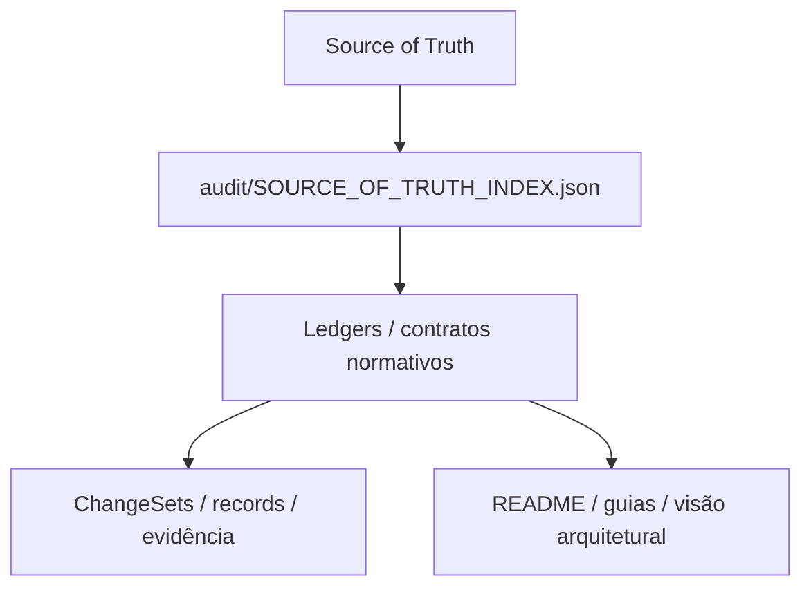

# NeoEng D-Core — Portal de documentação

Este diretório reúne documentação de uso, arquitetura, contratos, governança e evidência do **NeoEng D-Core**.

O portal separa documentação **explicativa** de documentação **normativa/histórica** para evitar que um exemplo, resumo ou guia seja interpretado como fonte de autoridade.

## Comece aqui

| Necessidade | Documento |
|---|---|
| Visão geral do produto | [`ARCHITECTURE_OVERVIEW.md`](ARCHITECTURE_OVERVIEW.md) |
| Estado atual e identidades | [`PROJECT_STATUS.md`](PROJECT_STATUS.md) |
| Integração de aplicações/hosts | [`INTEGRATION_GUIDE.md`](INTEGRATION_GUIDE.md) |
| Guia de uso detalhado | [`USER_GUIDE_PT-BR.md`](USER_GUIDE_PT-BR.md) |
| Resultados, evidência e claims | [`RESULTS_AND_CLAIMS_GUIDE.md`](RESULTS_AND_CLAIMS_GUIDE.md) |
| Troubleshooting | [`TROUBLESHOOTING.md`](TROUBLESHOOTING.md) |
| Segurança e trust boundaries | [`SECURITY_AND_TRUST_BOUNDARIES.md`](SECURITY_AND_TRUST_BOUNDARIES.md) |

## Hierarquia documental



Para decisão normativa, siga a precedência registrada em [`../audit/SOURCE_OF_TRUTH_INDEX.json`](../audit/SOURCE_OF_TRUTH_INDEX.json).

## Documentação normativa e de governança

- [`governance/NEOENG_DCORE_SOURCE_OF_TRUTH.md`](governance/NEOENG_DCORE_SOURCE_OF_TRUTH.md) — fonte normativa primária.
- [`../audit/SOURCE_OF_TRUTH_INDEX.json`](../audit/SOURCE_OF_TRUTH_INDEX.json) — precedência, ledgers e verificadores.
- [`governance/PRODUCT_COMPLETION_STANDARD.md`](governance/PRODUCT_COMPLETION_STANDARD.md) — critérios de conclusão.
- [`governance/PRODUCT_ASSURANCE_TEST_STANDARD.md`](governance/PRODUCT_ASSURANCE_TEST_STANDARD.md) — assurance.
- [`governance/POST_1_14_1_EVOLUTION_MASTER_PLAN.md`](governance/POST_1_14_1_EVOLUTION_MASTER_PLAN.md) — programa de evolução.
- [`governance/POST_1_14_1_EVOLUTION_MASTER_PLAN_V1_5_AMENDMENT.md`](governance/POST_1_14_1_EVOLUTION_MASTER_PLAN_V1_5_AMENDMENT.md) — amendment efetivo indicado pelo Source of Truth Index.
- [`governance/DLAB_VALIDATION_STANDARD.md`](governance/DLAB_VALIDATION_STANDARD.md) — requisitos do D-Core para validação externa no programa evolutivo.
- [`governance/DOCUMENT_STATUS_INDEX.md`](governance/DOCUMENT_STATUS_INDEX.md) — índice de reconciliação documental.

## Contratos

O diretório [`contracts/`](contracts/) contém contratos específicos. Entre os principais:

- [`contracts/HOST_SDK_C_ABI_V1.md`](contracts/HOST_SDK_C_ABI_V1.md)
- [`contracts/STATE_EVIDENCE_V1.md`](contracts/STATE_EVIDENCE_V1.md)
- [`contracts/TEMPORAL_CLOSURE_V1.md`](contracts/TEMPORAL_CLOSURE_V1.md)
- [`contracts/PRODUCTION_SECURITY_V1.md`](contracts/PRODUCTION_SECURITY_V1.md)
- [`contracts/DISTRIBUTED_REFERENCE_V1.md`](contracts/DISTRIBUTED_REFERENCE_V1.md)
- [`contracts/RELEASE_ASSURANCE_V1.md`](contracts/RELEASE_ASSURANCE_V1.md)
- [`contracts/HARDWARE_QUALIFICATION_V2.md`](contracts/HARDWARE_QUALIFICATION_V2.md)

## Fronteiras arquiteturais

O diretório [`architecture/`](architecture/) detalha onde cada capacidade termina:

- [`architecture/HOST_SDK_BOUNDARY.md`](architecture/HOST_SDK_BOUNDARY.md)
- [`architecture/TEMPORAL_CLOSURE_BOUNDARY.md`](architecture/TEMPORAL_CLOSURE_BOUNDARY.md)
- [`architecture/NUMERIC_CLOSURE_BOUNDARY.md`](architecture/NUMERIC_CLOSURE_BOUNDARY.md)
- [`architecture/PRODUCTION_SECURITY_BOUNDARY.md`](architecture/PRODUCTION_SECURITY_BOUNDARY.md)
- [`architecture/DISTRIBUTED_REFERENCE_BOUNDARY.md`](architecture/DISTRIBUTED_REFERENCE_BOUNDARY.md)
- [`architecture/QUALIFICATION_BOUNDARY.md`](architecture/QUALIFICATION_BOUNDARY.md)

## Claims públicas

[`commercial/PUBLIC_CLAIMS.md`](commercial/PUBLIC_CLAIMS.md) é gerado a partir do ledger normativo e contém somente claims autorizadas e seus escopos.

Não converta:

- “verified em Linux x86_64 GCC/Clang” em “funciona igualmente em qualquer arquitetura”;
- “loopback reference” em “transporte distribuído de produção”;
- “hash igual” em “regra de negócio universalmente correta”;
- “release aceita” em “certificação externa”;
- “D-Lab observou” em “claim do produto” sem o fluxo governado correspondente.

## Evidência histórica

[`changesets/`](changesets/) e [`records/`](records/) preservam histórico, resultados, falhas e decisões. Esses materiais são deliberadamente append-only ou históricos. Não devem ser reescritos apenas para harmonizar linguagem de documentação nova.

[`VALIDATION_REPORT.md`](VALIDATION_REPORT.md) e [`TRACEABILITY_YEAR1.md`](TRACEABILITY_YEAR1.md) são registros históricos/contextuais e devem ser lidos com sua data, baseline e escopo.

## Relação com D-Lab

Dentro da governança do D-Core, “D-Lab” designa infraestrutura de validação externa. Isso não transforma o laboratório no produto:

```text
D-Core                               D-Lab
produto/runtime                      laboratório externo
autoridade canônica                  executor/verificador
Host SDK / contratos                 adapter/oracle/evidência
claims do produto                    verdicts de campanha
governança do produto                governança do laboratório
```

A transferência de evidência entre esses domínios exige provenance e decisão governada; nunca é implícita.

## Contribuindo com documentação

Ao alterar documentação de apresentação:

1. não reescreva evidência histórica;
2. não amplie claim;
3. diferencie release aceita de tip atual de `main`;
4. mantenha links relativos válidos;
5. preserve exemplos dentro da ABI e dos contratos atuais;
6. trate ausência de evidência como ausência de aprovação;
7. submeta a mudança ao ChangeSet/validação aplicável antes de integração.
