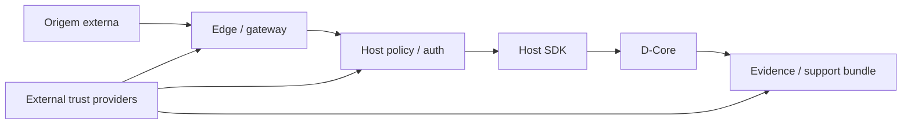

# NeoEng D-Core — Segurança e fronteiras de confiança

Este documento é uma visão explicativa. O contrato normativo de produção está em [`contracts/PRODUCTION_SECURITY_V1.md`](contracts/PRODUCTION_SECURITY_V1.md).

## 1. Princípio

O D-Core protege invariantes do estado e fornece mecanismos de segurança/observabilidade dentro de sua superfície. Ele não deve absorver responsabilidades pertencentes ao host, rede, identidade, provider criptográfico ou deployment.



## 2. O que pertence ao D-Core

Dependendo do contrato aplicável:

- validação de estruturas e invariantes;
- estados/códigos de rejeição;
- ordenação/transição canônica;
- recovery state machine;
- traces e evidência;
- boundaries de produção;
- mecanismos para integrar providers externos.

## 3. O que não deve ser atribuído automaticamente ao D-Core

- proteção DDoS de borda;
- WAF/API gateway;
- identidade corporativa;
- PKI completa;
- HSM/TPM;
- custódia/rotação operacional de chaves;
- channel establishment da aplicação;
- consenso distribuído;
- transporte WAN de produção;
- observabilidade de infraestrutura inteira;
- certificação externa.

## 4. Network ingress

Não exponha a ABI C diretamente como parser de datagramas hostis.

Antes do Host SDK, um host/gateway deve aplicar, conforme arquitetura:

- framing/tamanho/magic/version;
- autenticação;
- autorização;
- anti-replay;
- rate limiting;
- validação de origem;
- policy de comando;
- fila/ordenação compatível com determinismo.

Os limites internos de network security não equivalem a proteção DDoS global.

## 5. Canonical state versus segurança operacional

Nem todo dado operacional pertence ao estado canônico.

Correlation IDs, timestamps e telemetria podem ser necessários para diagnóstico, mas não devem contaminar o resultado determinístico quando o contrato os classifica como não canônicos.

## 6. Recovery

Recovery é uma fronteira de confiança entre runtime e host:

```text
D-Core detecta/recebe fault
        ↓
D-Core produz directive/action/generation
        ↓
host/deployment executa ação
        ↓
host reconhece resultado
        ↓
D-Core aceita ou rejeita acknowledgement
```

O runtime não deve assumir que um efeito externo ocorreu apenas porque foi solicitado.

## 7. Efeitos externos

Rollback do estado canônico não implica rollback físico de transação externa, mensagem já entregue, escrita irrevogável, comando a hardware ou side effect remoto.

Integrações devem usar protocolos como prepare/confirm/commit/compensate quando o contrato do domínio exigir.

## 8. Support bundles

Support bundles devem minimizar segredos e preservar integridade.

Não inclua inadvertidamente:

- chaves privadas;
- tokens;
- secrets;
- raw identifiers não necessários;
- material de sessão;
- credenciais de provider.

O verifier de bundle valida integridade/estrutura; isso não substitui uma política de confidencialidade do deployment.

## 9. Release provenance

SBOM, manifestos, hashes e attestations fornecem provenance para artefatos específicos. Eles não significam que qualquer árvore local é a release publicada.

Sempre vincule:

```text
release/tag
artifact digest
source commit
attestation/provenance
```

## 10. Distributed reference

A referência distribuída é deliberadamente limitada. Não use a presença de UDP loopback como justificativa para claims de secure transport remoto, consensus, BFT, quorum, multiwriter ou exactly-once universal.

## 11. D-Lab externo

Um D-Lab pode atacar a superfície do D-Core com testes adversariais e produzir evidência. Isso é uma boundary de assurance, não runtime.

O laboratório:

- não deve modificar o checkout sob teste durante o run;
- não fornece segurança operacional ao produto;
- não substitui provider de confiança;
- não amplia claim automaticamente;
- não deve ser embutido como dependência necessária ao runtime.

## 12. Responsabilidades de deployment

O deployment continua responsável por itens como secrets, trust roots, identidade, configuração segura, isolamento de processo, firewall/edge, logs operacionais, backup, disaster recovery externo, hardware/firmware e atualização do deployment.

## 13. Como escrever uma claim de segurança

Prefira:

> “O D-Core rejeita X dentro do contrato Y no corpus/ambiente Z.”

Evite:

> “O sistema é seguro.”

A primeira frase é verificável e escopada; a segunda apaga as fronteiras de confiança.

## 14. Documentos relacionados

- [`contracts/PRODUCTION_SECURITY_V1.md`](contracts/PRODUCTION_SECURITY_V1.md)
- [`architecture/PRODUCTION_SECURITY_BOUNDARY.md`](architecture/PRODUCTION_SECURITY_BOUNDARY.md)
- [`contracts/SUPPORT_BUNDLE_V1.md`](contracts/SUPPORT_BUNDLE_V1.md)
- [`commercial/PUBLIC_CLAIMS.md`](commercial/PUBLIC_CLAIMS.md)
- [`RESULTS_AND_CLAIMS_GUIDE.md`](RESULTS_AND_CLAIMS_GUIDE.md)
